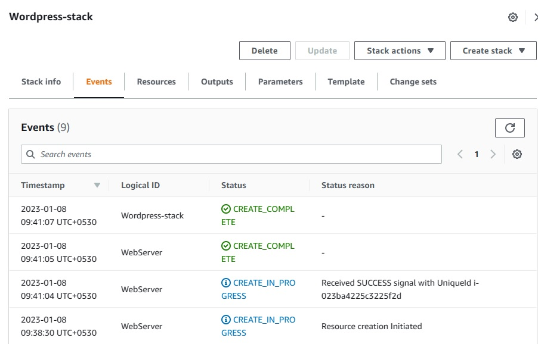

# Wordpress Using CloudFormation

CloudFormation is a method of provisioning AWS infrastructure using code. It allows you to model a collection of related resources, both AWS and third party, to provision them quickly and consistently.CloudFormation is designed to help you manage your AWS resources, especially associated resources. You can use CloudFormation to group resources with dependencies into stacks using templates.

CloudFormation works by defining your AWS resources in a structured text file in either JSON or YAML formats. This is known as a CloudFormation template. Using the template, you then create a CloudFormation stack in AWS which contains all the resources you defined.

To manage your resources you amend your CloudFormation template and update it, which will execute the changes to the resources in your stack.

When you make changes, CloudFormation tracks the template and executes the changes or optionally creates a “Change Set” for approval.

# Setup

1. Open the CloudFormation in AWS console.
2. click on Create Stack
3. Click on Use and sample template and select Wordpress blog from sample templates.
4. Click on Next
5. Enter :
    * Stack name - Wordpress-stack
    * Dbname - wordpressdb
    * DBPassword - admin123
    * DBUser - admin
    * Select keypair in keyname.
6. click Next, Review all the settings and submit
7. Now select created stack and view the Events.
8. After everything successfully completed a message is displayed on events.
   
9.  Goto EC2 , you can see a instance is created by Cloudformation. Copy the IPV4 address of instance and paste in browser Ipv4/wordpress, Then you can see the wordpress page signup and login into it. You can see the welcome page. Thats it.   
   
