# Capstone
In this lab, you will create the VPC inside your AWS account. As you know, before you create VPC, you need to select a region by considering factors like cost, compliance, latency, etcetera. You will also need two subnets inside your VPC. A public subnet to host your web application. For that, you will launch an EC2 Instance. Also, a Private subnet to deploy your RDS MySQL database. Then, you will set up the connection between RDS and EC2, then install the WordPress website on the instance. Finally, you will start hosting a simple WordPress website on an EC2 instance and -> export the static assets into the S3 bucket.

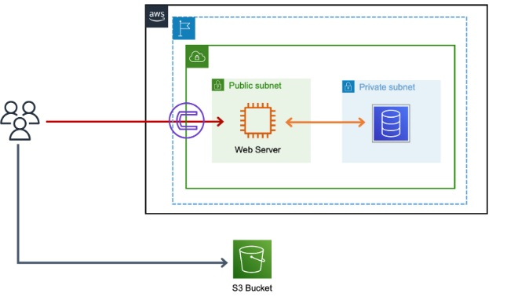

# Steps

1. Create IAM User with console And Programatic Access.
2. Creating VPC with private and public Subnets. 
3. creating Private RDS
4. Creating EC2 and Installing Wordpress
5. Linking Database with EC2
6. Accessing the WordPress
7. export the static assets into the S3 bucket.

# Setup

## Create IAM User with console And Programatic Access.

1. Go to IAM Service In AWS Console
2. Click on Users -> Create User
3. Give the User name - WordpressUser, Enable Programmatic access and Aws Management Console Access.
   > If You are using the Root Account for the Project Setup , then You can disable the Aws Management Console Access
  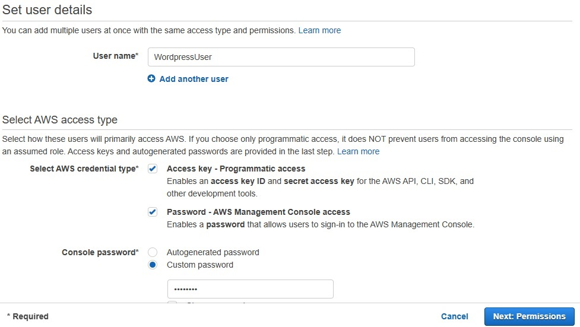
4. Next: Permissions -> click on Attach Existing Policies and select **AdministratorAccess** if you want to use it for project setup , else select **S3FullAccess** .
  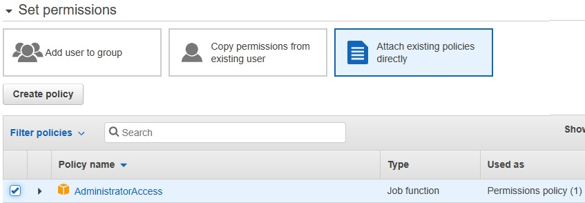 
5. Review the permissions and Create user.
6. Download the CSV file and use it when you want to access AWS cli. It contains Access key id and Secret access key id.
   
   

## To Create VPC with private and public Subnets:

1. Goto VPC -> Create VPC -> Give name and use 10.0.0.0/16 as IPv4 CIDR block 
   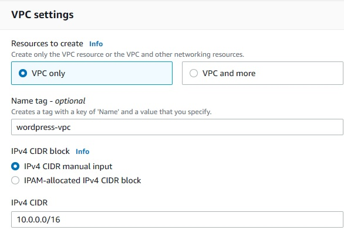

2. Create subnet -> select the vpc which  is above created
   
    * Subnet-1 -> public subnet, 10.0.0.0/24
    * Subnet-2 -> private subnet, 10.0.1.0/24
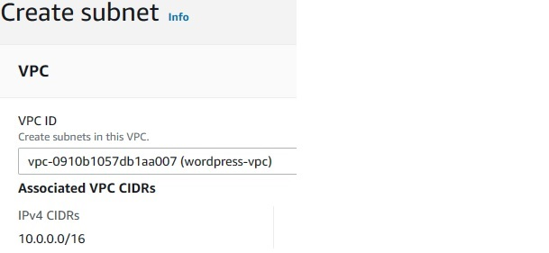
  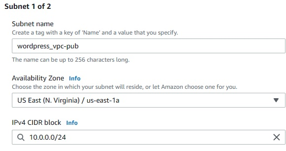
  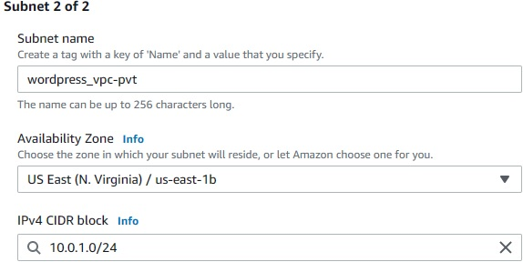
3. Create InternetGateway and Attach it to vpc we created above.
   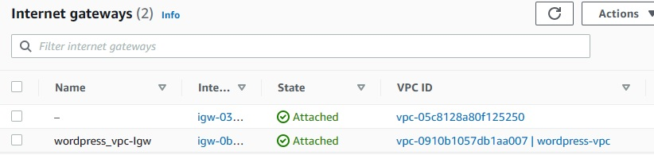
4. Create two route tables one for public and other for private. while creating select the vpc we created above.

      * select public route -> edit subnet associations -> select public subnet
      * select public route -> edit routes -> add route -> Destination - 0.0.0.0/0 , target - Internetgateway we created earlier
      * select private route -> edit subnet associations -> select private subnet
   
    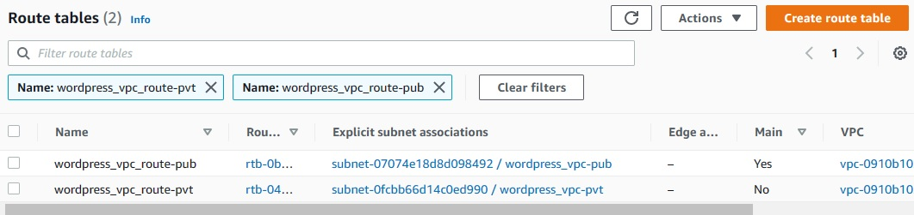

## To creat Private RDS

1. Goto RDS -> create Database
   
    * database creation method - Standard create
    * Engine type - MySQL
    * Templates - Free tier
    * DB instance identifier - database
    * Master username - admin
    * Master password - admin123
    * Disable Storage autoscaling.
    * Virtual private cloud (VPC) - Wordpress-vpc
    * Public access - **No**
    * Additional Configuration -> Database options -> Intial databse name - **wordpressdb**
    
2. After Creating Database , Select database -> click on vpc Security Group -> edit inbound rules. 
    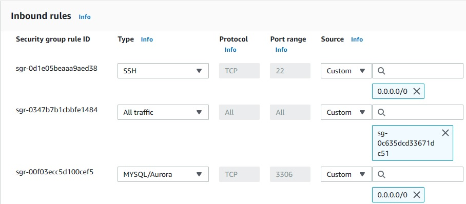

## To Creat EC2 and Installing Wordpress
1. Launch Instance - name it as **wordpress-server**
   
    * Amazon Machine Image - Amazon linux 2 AMI
    * Instance type - t2.micro
    * Create a kety pair or use existing
    * In network settings -> select our vpc, select public subnet, Enable the auto assign public ip and create a security grp "wordpress-sg",  Add rules to it. Launch Instance.
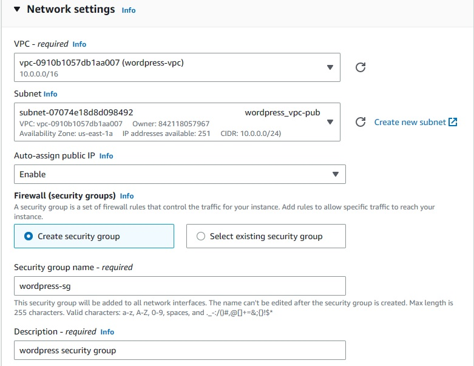
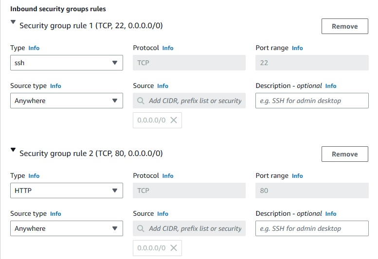

2. Connect to the instance using cmd or gitbash etc..
    
     * move the the folder where you saved the keypair and type this:
    #
         $ chmod 400 wordpress-tutorial-key.pem   
         $ ssh -i "N.virginia-key.pem" ec2-user@publicIpv4_of_EC2Instance 
3. Wordpress Installation:

    ### First we’ll check if there are any updates needed:
    
        $ sudo yum update -y

    ### Then we install PHP
        $ sudo amazon-linux-extras install -y php7.2

    ### Next, install Apache
        $ sudo yum install -y httpd

    ### Start the Apache Service
        $ sudo systemctl start httpd
    
    ### And make sure apache is always started when launching the instance
        $ sudo systemctl enable httpd
    **Configure permissions for ec2-user**:
    ### Add the ec2-user to the apache group:
        $ sudo usermod -a -G apache ec2-user
    ### Log out with $ exit and log back in with the ssh command from above.Next, the permissions for the group must be changed for /var/www:
        $ sudo chown -R ec2-user:apache /var/www
    ### The write permissions and also all future directories must be set as well:
        $ sudo chmod 2775 /var/www && find /var/www -type d -exec sudo chmod 2775 {} \;
    ### And finally the same for the files:
        $ find /var/www -type f -exec sudo chmod 0664 {} \;
    **Installing the WP CLI**
    ###
        $ curl -O https://raw.githubusercontent.com/wp-cli/builds/gh-pages/phar/wp-cli.phar
        $ php wp-cli.phar --info
        $ chmod +x wp-cli.phar
        $ sudo mv wp-cli.phar /usr/local/bin/wp
    ### Now, check if the cli is available:
        $ wp — info
    **WordPress Installation**
    ### Navigate to /var/www/html and run
        $ wp core download
4. To check Installation is succesfull , go to /var/www/html . if files of wordpress are available, then it is done. 
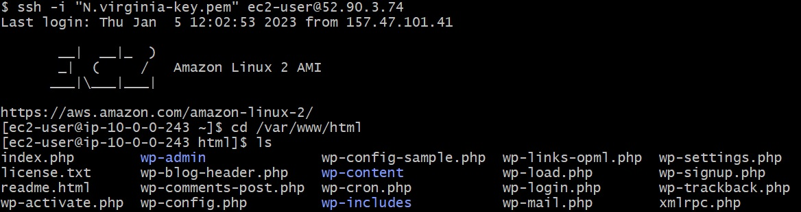

## Linking Database with EC2
 * Run The below commands to link database with Wordpress Server
    
        $ sudo yum install mysql
        $ mysql -h <RDS_Endpoint_Link> -P 3306 -u <username> -p
        
        
 * To Check Database is linked
        
        > show databases;
        > use wordpressdb;
        > show tables;  
     

    
    

## To Access the WordPress
   
1. Copy the Public IP Address of Wordpress server we created and Paste it your Favourite Website.

    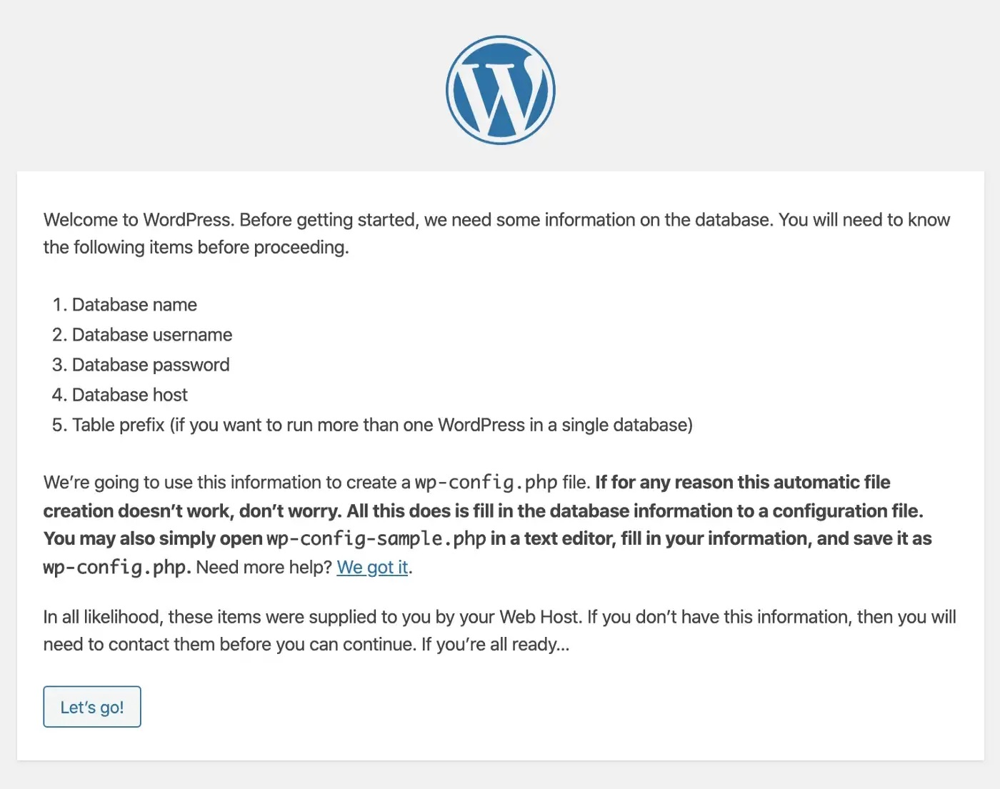

2. Now click on letsgo, you need to enter 

    * Database name     -> database(Rds Name you created with)
    * Database username -> admin (The username while creating RDS)
    * Database password -> admmin123 (RDS password while creating RDS)
    * Database Host     -> Rds Enpoint link

3. Then next -> it will Ask for username and password , after that you need to Relogin. 
    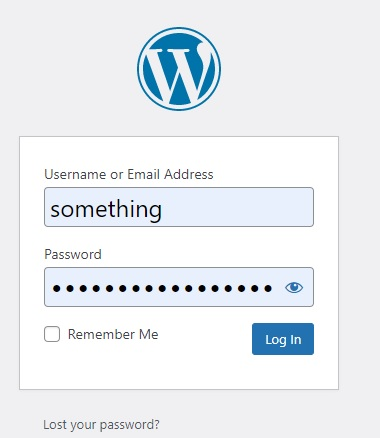

4. After click login -> you will be seeing a dashboard - **Welcome to WordPress!**

    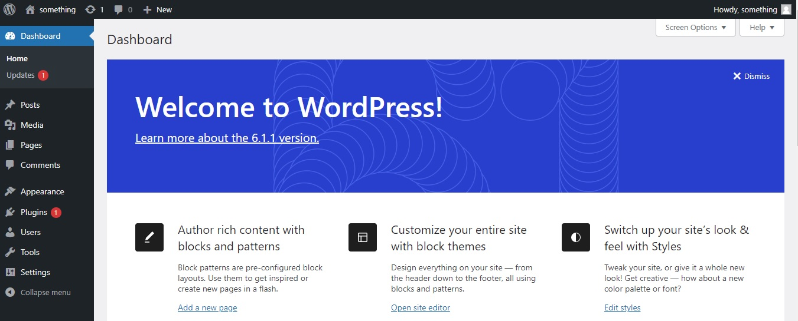

## To export the static assets into the S3 bucket.
1. Create a S3 Bucket with Unique Name.
2. Install aws cli

       $ Sudo yum install awscli -y

3. To configure Enter:
   
       $ aws configure
4. Enter your Aws Access Key Id , Aws Secret Access Key, Region Name, Output Format(json) .
    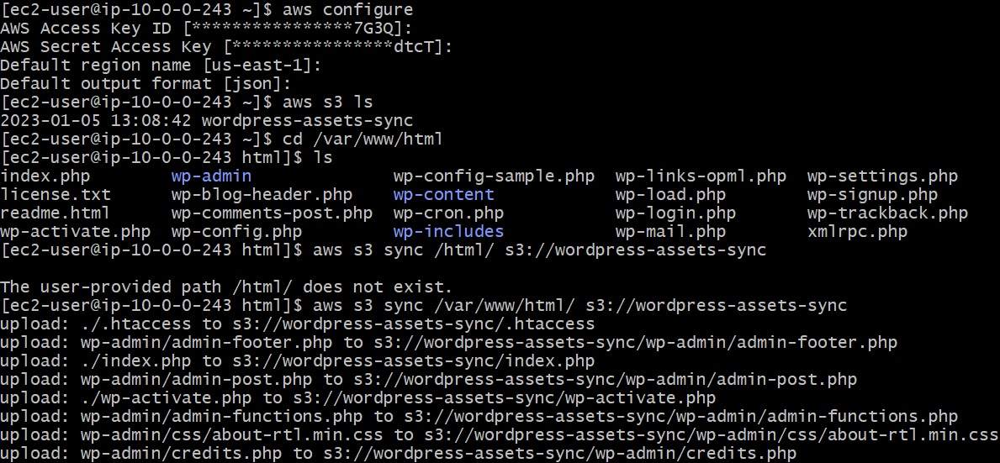
5. To sync the files to S3 Bucket run this command:
       
       $ aws s3 sync /var/www/html/ s3://wordpress-assets-sync
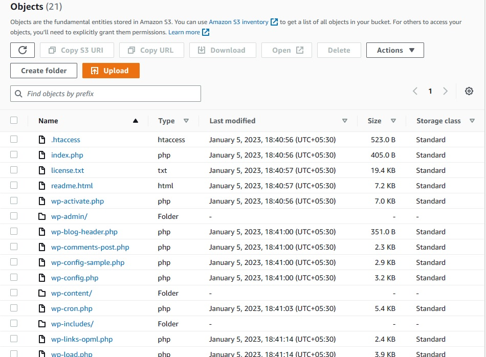