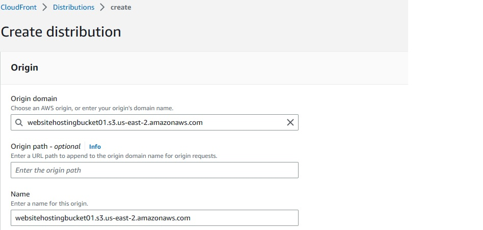
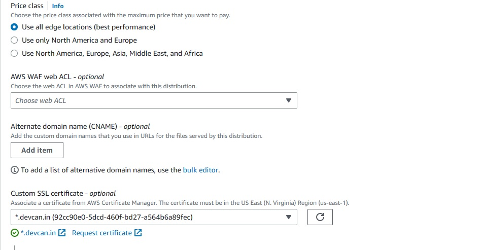
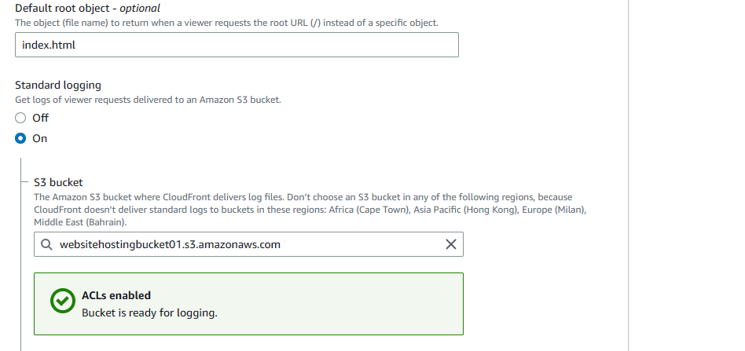
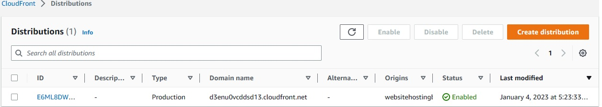
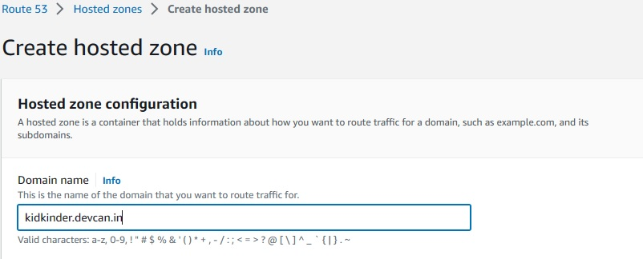
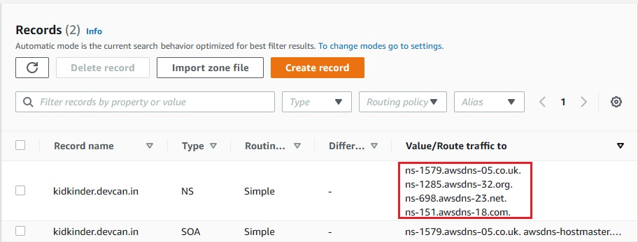
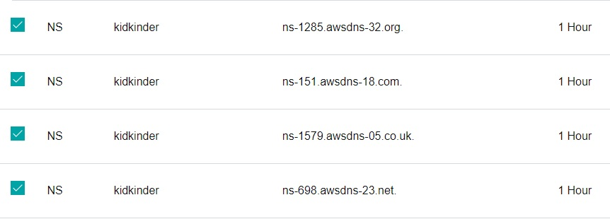
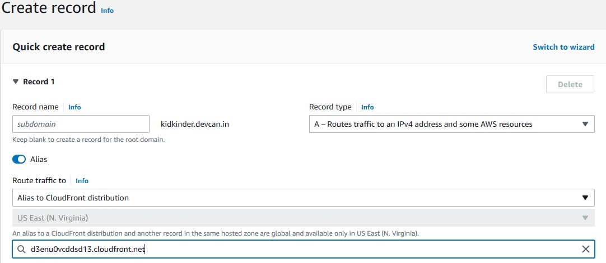
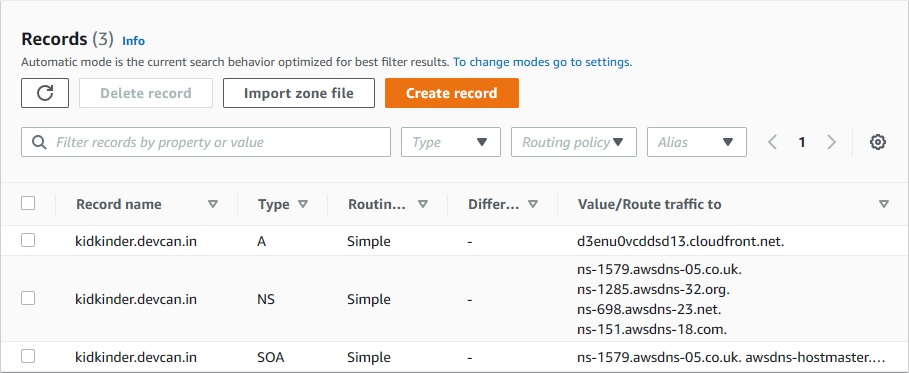

# Static Website with CloudFront and Route53

You can use Amazon CloudFront to improve the performance of your Amazon S3 website. CloudFront makes your website files (such as HTML, images, and video) available from data centers around the world (known as edge locations). When a visitor requests a file from your website, CloudFront automatically redirects the request to a copy of the file at the nearest edge location. This results in faster download times than if the visitor had requested the content from a data center that is located farther away.

CloudFront caches content at edge locations for a period of time that you specify. If a visitor requests content that has been cached for longer than the expiration date, CloudFront checks the origin server to see if a newer version of the content is available. If a newer version is available, CloudFront copies the new version to the edge location. Changes that you make to the original content are replicated to edge locations as visitors request the content.

# steps

1. Create a bucket
2. Create a CloudFront distribution
3. Update the record sets for your domain and subdomain
4. Check the log files

# setup

## **To Create a Bucket**

* Create a bucket with unique name. 
- Uploaded a website folder
* Enabling static website host in properties section
- Entering 'index.html' in index document.
* Paste aws s3 public bucket policy.
- Copy the url and paste it in the browser.
  
## **To create a CloudFront Distribution**

>First, you create a CloudFront distribution. This makes your website available from data centers around the world.

1. Open the CloudFront console and Choose Create Distribution.
2. On the Create Distribution page, in the Origin Settings section, for Origin Domain Name, enter the Amazon S3 website endpoint for your bucket - for example, *example.com.s3-website.us-west-1.amazonaws.com.*
   
3. For Distribution Settings, do the following:
 
    * Leave Price Class set to Use All Edge Locations (Best Performance).

    * Set Alternate Domain Names (CNAMEs) to the root domain and www subdomain. In this tutorial, these are example.com and *www.example.com.*
    * For SSL Certificate, choose Custom SSL Certificate (example.com), and choose the custom certificate that covers the domain and subdomain names.
  
    * In Default Root Object, enter the name of your index document, for example, *index.html*.
    * Set Logging to On. To save the log files.
  
4. Choose Create Distribution.
5. Record the value of Domain Name shown in the CloudFront console, for example, *dj4p1rv6mvubz.cloudfront.net.* To verify that your CloudFront distribution is working, enter the domain name of the distribution in a web browser.
    
   
## **To Update the record sets for your domain and subdomain**

1. Open the Route 53 console and create a Hosted Zone.
    
2. On the Hosted Zones page, choose the hosted zone that you created for your subdomain, for example, www.example.com.
    
     - copy the Name servers one by one and add them in your domain dns. I used Godaddy.
        
1. Under Record details, choose Edit record.
2. Under Route traffic to, choose Alias to CloudFront distribution.
   
3. Under Choose distribution, choose the CloudFront distribution. and save
   
> The update to the record sets takes effect within 2–48 hours.

## **To check the log files**

1. Open the Amazon S3 console 
2. Choose the name of the logging bucket for your website
3. Choose the CloudFront logs folder.